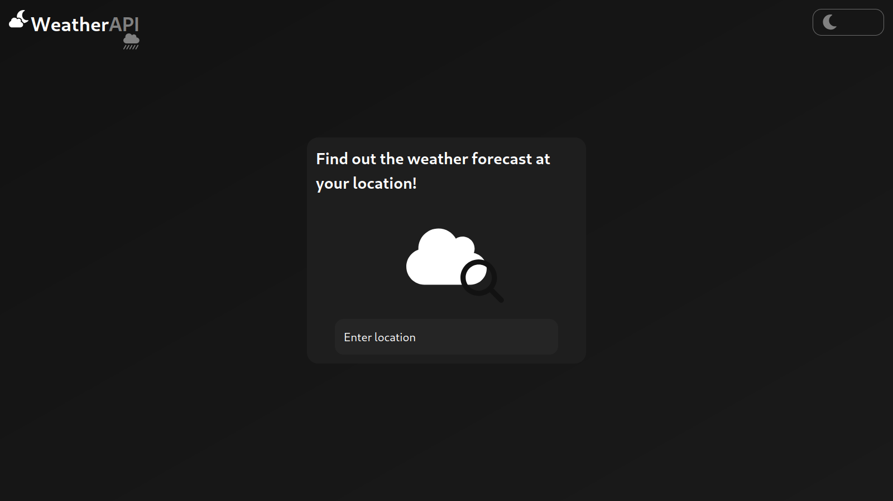
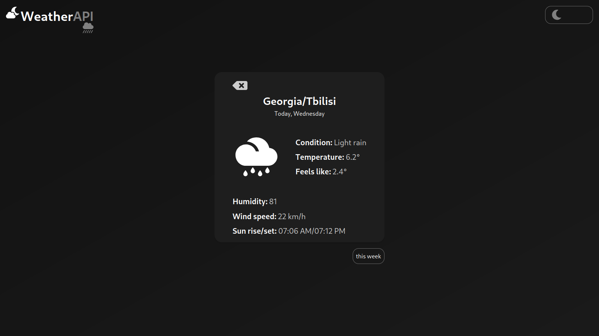
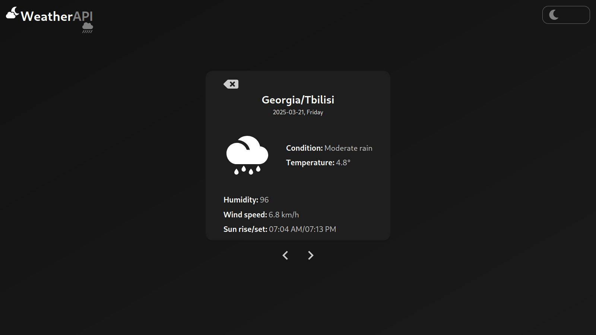
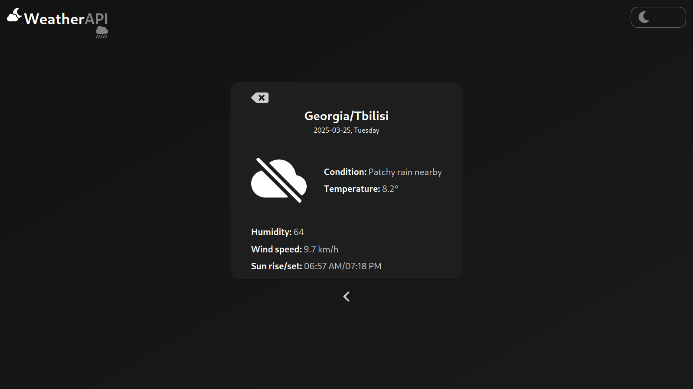
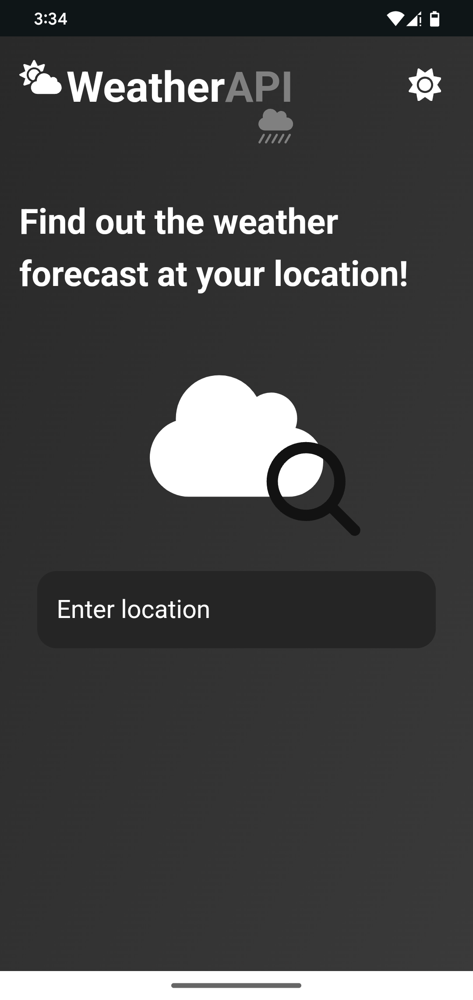
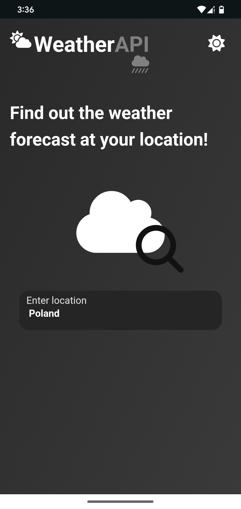
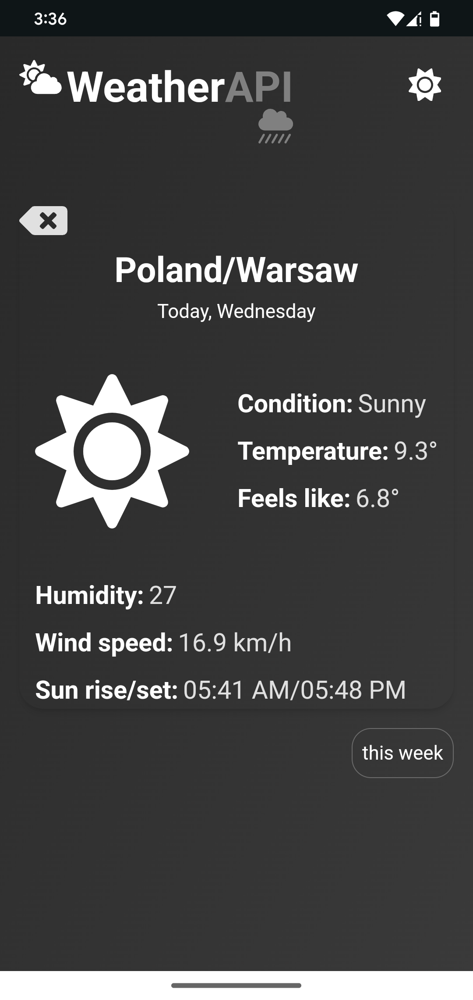
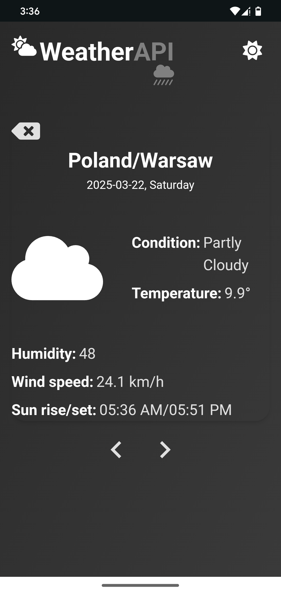

# Weather Forecast Application

This is a weather forecast application that uses an external api to fetch weather data for requested location.

## Languages used
- **Javascript**
- **HTML**
- **CSS**

## Frameworks used
- **React**
- **Tailwind CSS**

## Features
The application will provide the following data for your location

- **Temperature**
- **Feels like**
- **Condition** (sunny, cloudy, etc.)
- **Humidity**
- **Wind speed**
- **Sun rise/set hours**

Initially only weather forecast for the current day will be available, but it only take a click of a button to fetch data for the whole week.

(Note: forecast for the future is just a little less descriptive)

## Prerequisites
- **npm**
- **Node.js**

## Setup
1. **Clone the github repository**:
```
git clone https://github.com/dayzyy/API-WeatherForecastApp.git
```

2.  **Install the dependencies**:
```
cd API-WeatherForecastApp/frontend/
npm install
```

3. **Get your API key**. This project uses an external api, which requiers a unique API key for requests. You can log in at the following link: https://www.weatherapi.com/login.aspx and obtain your API key for free.

4. **Integrate your API key**
(API-WeatherForecastApp/frontend/)
```
touch .env
```
(API-WeatherForecastApp/frontend/.env)
```
VITE_WEATHER_API_KEY=<YOUR_API_KEY>
```

5. **Run the server**. Everything is set up now. Run the server and find out weather forecast at your location! (runs on localhost:3000 by default)

(API-WeatherForecastApp/frontend/)
```
npm run dev
```

## Screenshots

### Desktop








### Mobile








**@dayzyyiwnl**
